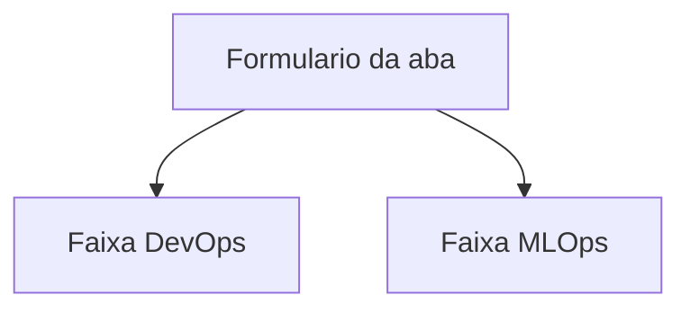
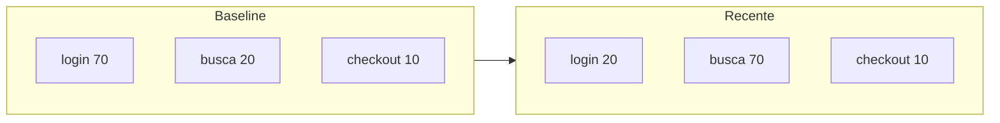
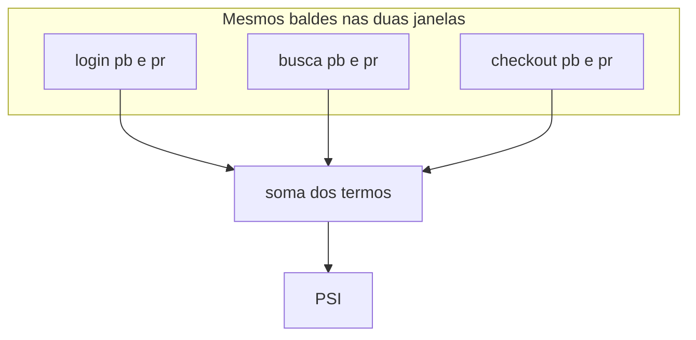
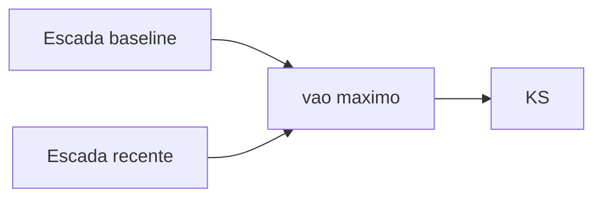

# Monitoramento

Um serviço no ar responde a pedidos. No log de cada pedido cabem o tempo
(`latency_ms`) e se houve erro. A taxa de erro é a fração de linhas com
falha. A latência é `t_fim − t_início`.

A média desses tempos descreve o dia típico e esconde a cauda. p95
(percentil 95) é o valor que 95% dos pedidos já bateram, depois de ordenar
a lista.

```text
# Variáveis:
# xs — latências da janela
# ys — xs ordenada
# k  — índice a 95% do caminho

ys ← ordenar(xs)
k  ← inteiro(0.95 × (tamanho(ys) − 1))
p95 ← ys[k]
```

Dez latências, em ms: `10, 11, 10, 12, 11, 13, 12, 14, 12, 80`.

Ordenadas: `10, 10, 11, 11, 12, 12, 12, 13, 14, 80`.
`k = inteiro(0,95 × 9) = 8`, então p95 = 14. A média é 18,5 por causa do
`80`. Quase todos os pedidos saíram em 14 ms; um ficou em 80.

Erro e p95 estáveis deixam a faixa DevOps do painel em ritmo de processo
saudável. Essa faixa mede o serviço no ar. A mistura do que chega na
porta é a outra medição, na faixa MLOps.

## O que fazer nesta página

Abrir o painel, enviar pedidos pelos formulários e ler as duas faixas:
DevOps (processo) e MLOps (mistura e saída do modelo). Os nomes nos
cards do browser são a lenda. As contas de p95, PSI e KS estão abaixo,
para quando a faixa pedir o porquê.

## Abrir o painel

Python 3.11+. Na raiz do clone, o setup deixa o ambiente e os logs
prontos. O painel abre no browser.

```bash
just setup
```

Na primeira vez, `exemplos/tokens/` baixa o tokenizer para `hf-cache/`
na raiz do clone (vocabulário). Essa etapa usa a rede.

```bash
just painel
```

Esse comando ocupa o terminal. Deixe-o aberto e vá ao browser:
[http://127.0.0.1:3001/gui/](http://127.0.0.1:3001/gui/) ou
[http://localhost:3001/gui/](http://localhost:3001/gui/).

A porta padrão é `3001`. Se ela estiver ocupada,
`just painel 3002` (ou outro número livre) e use esse número na URL.
`just painel 3000` sobe na 3000 quando essa porta estiver livre.

Abra uma aba. Leia as faixas DevOps e MLOps uma vez, ainda sem enviar.
Na aba Tokens, escreva `bom dia` e Enviar. O pedido entra no log da aba;
as faixas atualizam. Os três formulários (texto, `x`, brilho) estão em
[As três abas](#as-três-abas).

Se uma faixa pedir relatório: no outro terminal, na raiz do clone,
`just monitor`, e recarregue o browser.

Depois do painel, se quiser os passos isolados:

```bash
just gerar      # JSONL
just monitor    # exemplos/*/logs/report_*.json
just test       # pytest, sem Hugging Face
```

Detalhe do serviço e dos POST: [`gui/README.md`](gui/README.md).

## O que o painel mostra

Uma aba é um modelo. O formulário grava um pedido. As faixas leem o log.



As outras abas repetem esse esqueleto.

DevOps é a saúde do processo (o serviço no ar). Os cards:

- `p95 de latência (ms)` — a mesma ideia da abertura desta página
- `taxa de falha do serviço` — fração de pedidos com `error = true` (crash, timeout)

MLOps é a mistura que chega na porta e o que o modelo devolve. Os cards
mudam um pouco por aba; no conjunto aparecem:

- PSI (fatias nomeadas) — ver [PSI, no papel](#psi-no-papel)
- KS (listas de números) — ver [KS, no papel](#ks-no-papel)
- `MAE (erro do modelo)` na aba Regressão
- `confiança média` na aba Imagens

A taxa de falha conta o serviço que quebrou. O MAE conta
`|y observado − ŷ|` só nos pedidos em que o rótulo veio no formulário.
Os nomes no painel batem com esses cards; leia o que a faixa já escreve.

Depois de enviar `bom dia` e ver o resultado em Tokens, abra Regressão e
Imagens só para reconhecer o mesmo esqueleto. Os envios dessas abas
estão em [As três abas](#as-três-abas).

## A mistura do que chega na porta

Segunda-feira: 70 pedidos `/login`, 20 `/busca`, 10 `/checkout`.
Esta semana: 20 `/login`, 70 `/busca`, 10 `/checkout`.



Latência e 5xx podem ser os de sempre. As fatias de rota mudaram. Uma
regra ou um modelo ajustados na mistura antiga passam a ver outra
distribuição de entrada. O log já traz esses números. Compare uma janela
*baseline* (o acordo) com uma janela *recente*.

Coisa com nome de balde (rota, cidade, faixa de tokens, rótulo
`escuro`/`claro`): compare as fatias. Isso é PSI.

Coisa que é número numa reta (bytes do payload, brilho médio, preço
previsto): compare as duas listas. Isso é KS.

Noite na câmera, campanha que encurta texto, mercadoria mais cara: a
lista recente se afasta da baseline. Esse afastamento é o regime novo.

## PSI, no papel

PSI (Population Stability Index). Para cada balde, `pb` é a fração no
baseline e `pr` a fração na janela recente:

```text
# Variáveis:
# pb — fração do balde no baseline
# pr — fração do mesmo balde na recente
# psi — soma sobre os baldes

psi ← Σ (pr − pb) × ln(pr / pb)
```



Janelas iguais deixam PSI perto de 0. Fatias que trocam de lugar fazem
PSI crescer.

Tráfego de 100 pedidos:

| balde | n baseline | n recente | pb | pr | (pr − pb) × ln(pr / pb) |
| --- | ---: | ---: | ---: | ---: | ---: |
| login | 70 | 20 | 0,70 | 0,20 | 0,626 |
| busca | 20 | 70 | 0,20 | 0,70 | 0,626 |
| checkout | 10 | 10 | 0,10 | 0,10 | 0,000 |
| PSI | | | | | 1,253 |

Login: `(0,20 − 0,70) × ln(0,20 / 0,70) = (−0,50) × (−1,253) = 0,626`.
Busca: a mesma conta com `pb` e `pr` trocados. Checkout: zero.

O `monitor.py` dispara alerta de PSI em 0,2.

## KS, no papel

KS (Kolmogorov–Smirnov de duas amostras) é o maior vão vertical entre
duas escadas. Cada ponto do baseline sobe `1/n`; cada ponto da recente
sobe `1/m`. No valor `x`, a altura é a fração de pontos `≤ x`.

```text
# Variáveis:
# a, b — números do baseline e da recente
# sa, sb — as mesmas listas, ordenadas
# n, m — tamanhos
# valores — união ordenada dos números distintos
# i, j — quantos pontos de cada amostra são ≤ o valor corrente
# d — máximo de |i/n − j/m|

sa ← ordenar(a); sb ← ordenar(b)
n ← tamanho(sa); m ← tamanho(sb)
i ← 0; j ← 0; d ← 0
para cada x em valores:
    avance i enquanto sa[i] ≤ x
    avance j enquanto sb[j] ≤ x
    d ← máximo(d, |i/n − j/m|)
```



Payloads (KB), cinco pedidos em cada janela:

- baseline `a = (1, 2, 3, 4, 5)`
- recente `b = (3, 4, 5, 6, 7)`

| x | fração baseline ≤ x | fração recente ≤ x | vão |
| ---: | ---: | ---: | ---: |
| 1 | 0,2 | 0,0 | 0,2 |
| 2 | 0,4 | 0,0 | 0,4 |
| 3 | 0,6 | 0,2 | 0,4 |
| 4 | 0,8 | 0,4 | 0,4 |
| 5 | 1,0 | 0,6 | 0,4 |
| 6 | 1,0 | 0,8 | 0,2 |
| 7 | 1,0 | 1,0 | 0,0 |

KS = 0,4. A recente está deslocada para valores maiores. Listas iguais
dão vão 0 em cada linha e KS = 0.

O `monitor.py` dispara alerta de KS em 0,25.

PSI compara fatias nomeadas. KS compara os números. O mesmo log pode
mover os dois.

## As três abas

Os logs deste clone já têm uma janela recente deslocada. O painel mostra
isso nas faixas. Os envios abaixo acrescentam uma linha e deixam a faixa
recalcular.

**Tokens.** Texto em português → `n_tokens` e fatias curto / médio /
longo. A recente gerada é mensagem curta; o PSI de `n_tokens` mede essa
troca de fatias. Envie mais um texto curto (`bom dia` já vale) e depois
uma frase longa, por exemplo: `A turma entrega o relatório na sexta.`
Olhe `p95 de latência` em DevOps e `PSI de n_tokens` em MLOps.

**Regressão.** Um `x` entra; a reta do baseline devolve `ŷ`. A recente
gerada manda `x` maior, então `ŷ` sobe: KS na lista de `ŷ` e PSI nas
fatias baixo / médio / alto. Envie `x = 35`. Opcional: preencha
`y observado` com um número perto de `2,5·x + 10` se quiser ver o MAE
usar a linha. Sem esse campo o pedido ainda prevê `ŷ`; o MAE ignora a
linha. A `taxa de falha do serviço` continua sendo crash do código.

**Imagens.** Brilho médio 0–1 → balde, rótulo `escuro` / `medio` /
`claro`, confiança. A recente gerada é mais escura. Envie `0,15` (o
campo usa ponto: `0.15`). Olhe PSI de brilho, PSI de rótulo, KS de
brilho e confiança média.

## Os exemplos no clone

Cada pasta é a história daquela aba: o que entra no log e o que o
monitor compara. O caminho de estudo é o painel; os scripts geram o
JSONL que as faixas leem.

| Pasta | Entrada no log | O que o monitor compara |
| --- | --- | --- |
| [`exemplos/tokens/`](exemplos/tokens/) | texto pt_BR → `n_tokens` (tokenizer DistilBERT português) | PSI nos baldes curto/médio/longo; p95 da latência do `encode` |
| [`exemplos/regressao/`](exemplos/regressao/) | `x` → `ŷ = a·x + b` (reta do baseline) | KS na lista de `ŷ`; PSI nos baldes baixo/médio/alto; MAE se houver `y_obs` |
| [`exemplos/imagens/`](exemplos/imagens/) | imagem → brilho médio e rótulo | PSI nos baldes de brilho e de rótulo; KS no brilho contínuo |
